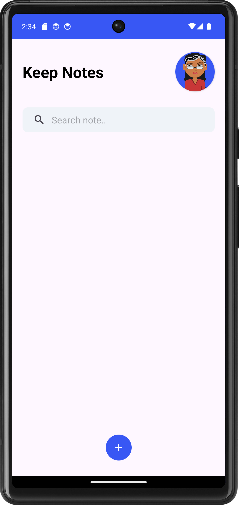
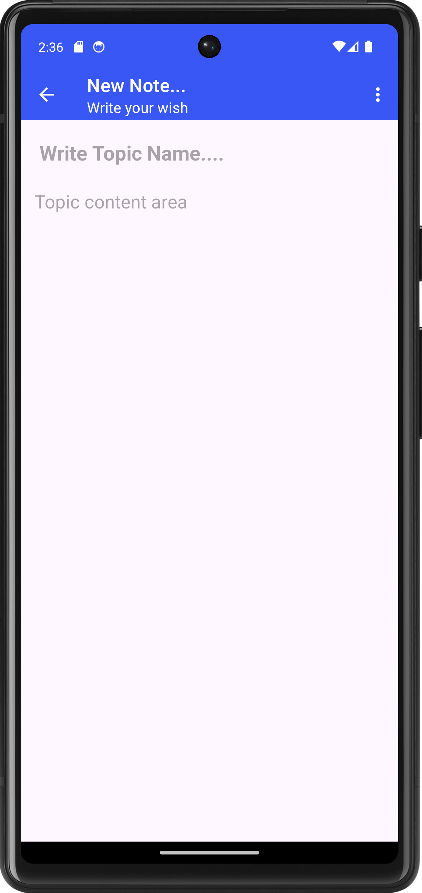
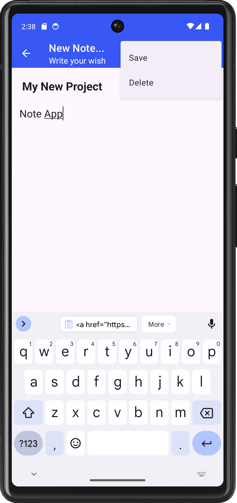
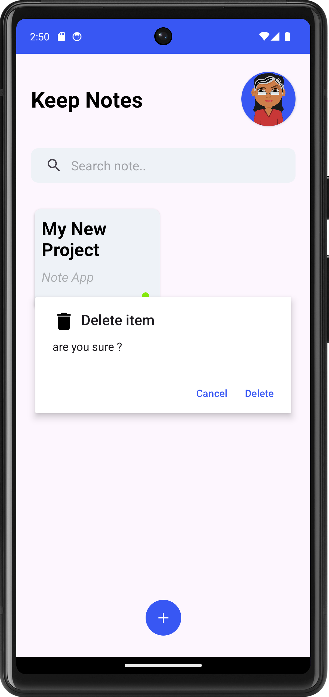

<h1>Note App</h1>
It is simple note app. In which peform crud operation. It is store the data in local database.

<h6>Click to download Note App Application</h6>

<a href="https://github.com/mauryanitish/Notes-App/releases/download/Version/app-debug.apk" title="Download" download>
    Download My Awesome App APK
</a>
 
<h4>Application Screen</h4>

First Screen open : 
 
 
 

Add note screen : 
 
 
 

Save and delete note : 
 
 
 

Show note on screen : 
 
 
 

Long click on item to delete pop-up box open : 
 

    
